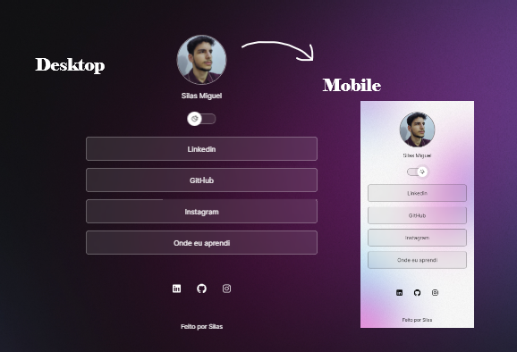

<h1 align="center"> Sobre Mim </h1>

Um Website que traz mais informações sobre mim.

  <a href="#-tecnologias">Tecnologias</a>&nbsp;&nbsp;&nbsp;|&nbsp;&nbsp;&nbsp;
  <a href="#-projeto">Projeto</a>&nbsp;&nbsp;&nbsp;|&nbsp;&nbsp;&nbsp;
  <a href="#-layout">Layout</a>&nbsp;&nbsp;&nbsp;|&nbsp;&nbsp;&nbsp;
  <a href="#memo-licença">Licença</a>

  

 

## 🚀 Tecnologias

Esse projeto foi desenvolvido com as seguintes tecnologias:

- HTML e CSS
- JavaScript

## 💻 Projeto

Um projeto feito com apenas programação web(Html,Css, Js), com o intuito de trazer mais informações sobre mim.  

Um agregador de links para usar como cartão de visitas online.

- [Acesse o projeto finalizado, online](https://silasmiguel.github.io/Sobre-Mim/)

## :memo: Licença

Esse projeto está sob a licença MIT.